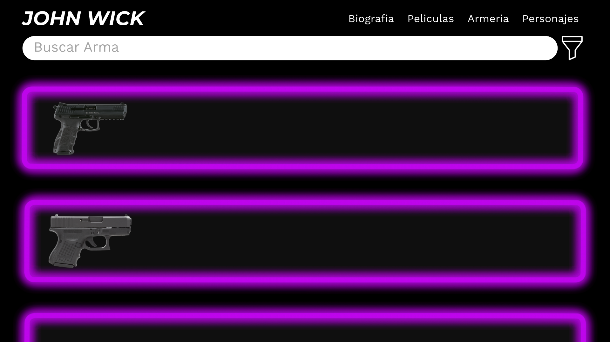
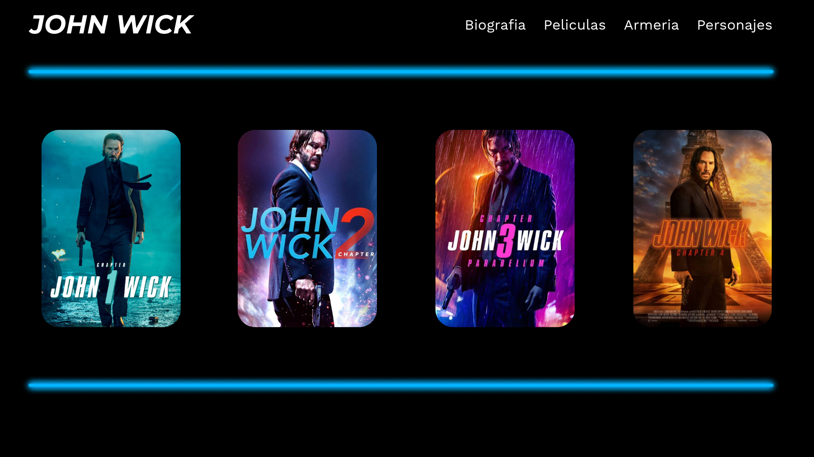
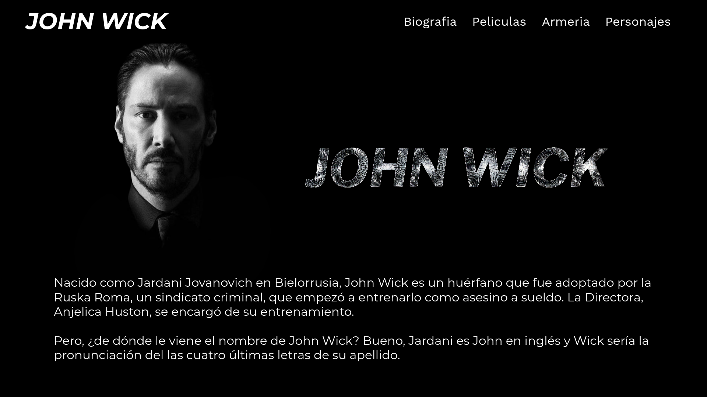

# 🧨 John Wick Fan Page

Una fan page interactiva, visual y completamente responsiva dedicada al universo cinematográfico de **John Wick**. Desde su historia hasta los personajes, películas y arsenal, esta web reúne todo lo que un verdadero fan necesita.

---

## 🎬 Características Principales

✅ **Biografía Detallada**  
✅ **Listado Completo de Películas**  
✅ **Base de Datos de Personajes**  
✅ **Armería con estadísticas visuales**  
✅ **Buscador + Filtros por Película**  
✅ **Componentes personalizados en JavaScript**  
✅ **Diseño optimizado para dispositivos móviles**

---

## 📁 Estructura del Proyecto


---
```
├── 📂 CSS/
│ └── HeroStyle.css
├── 📂 JavaScript/
│ ├── characters.js
│ ├── weapons.js
│ ├── john_wick_data.js
│ └── [componentes personalizados]
├── 📂 JSON/
│ ├── Characters.json
│ ├── Weapons.json
│ └── Movies.json
├── 📂 photos/ (biografía)
├── 📂 weapons/ (imágenes de armas)
├── 📂 icons/ (iconos generales)
├── index.html
├── history_page.html
├── movies_page.html
├── weapons_page.html
└── characters_page.html

```


## 🚀 Cómo usar el proyecto

1. Clona este repositorio:

```bash
git clone https://github.com/tu-usuario/john-wick-fanpage.git

```
## Maquetacion y Diseño

### 1. Hero page


### 2. Characters page


### 3. Weapons page



### 4. Movies page



### 5. History page



### 6. Movie information page


### 7. Weapon information page


### 8. Character information page


---

## 🛠️ Tecnologías Utilizadas

- **HTML5**
- **CSS3** (Flexbox + Media Queries)
- **JavaScript moderno** (Módulos, Fetch API, Componentes)
- **JSON** para la base de datos dinámica
- **Diseño responsivo** (Mobile-first)
- **Sombras, efectos neon y temas oscuros personalizados**

---

## 🔍 Funcionalidades Avanzadas

- 🔎 **Buscador en tiempo real** por personaje o arma
- 🎯 **Filtro por película** en secciones de armas y personajes
- 📊 **Visualización de estadísticas** (ergonomía, puntería, cadencia, retroceso)
- 🧩 **Carga dinámica desde archivos JSON**
- 🧱 **Componentes reutilizables personalizados** (`<weapon-easy-element>`, etc.)

---

## 🧠 Autor
Joan Sebastian Gomez Serrano (FUERZA G)
Diseñador y desarrollador web fan de John Wick 💀🔫

## 🌟 Inspiración
Este proyecto fue creado con la intención de rendir homenaje al icónico personaje interpretado por Keanu Reeves, explorando su historia, aliados, enemigos y herramientas en un solo lugar.
