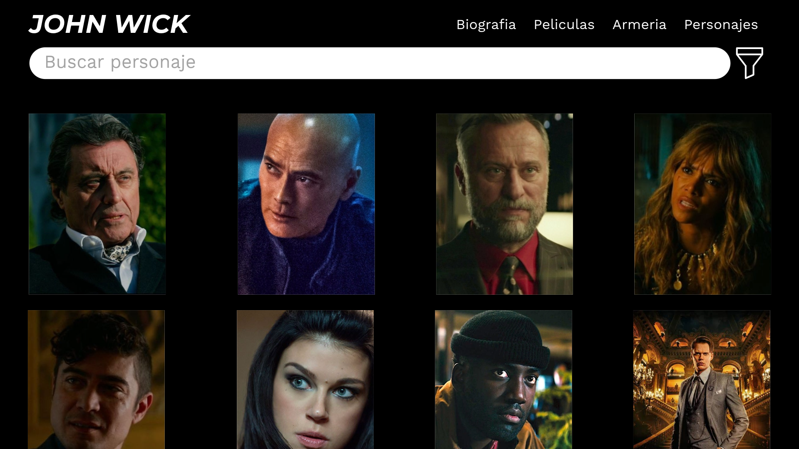

#  John Wick Fan Page

Una **fan page cinematográfica** dedicada a uno de los personajes más icónicos del cine de acción: **John Wick**. Este proyecto está desarrollado con **HTML** y **CSS**, incluye efectos visuales como fondo animado de lluvia, frases célebres, y un diseño inspirado en la estética oscura y elegante de la saga.

---

## 🎯 Características

- 💻 Diseño responsivo y adaptado para dispositivos móviles.
- 🖼️ Hero page con fondo personalizado de John Wick.
- ☔ Efecto de lluvia animado con CSS.
- 📖 Sección de biografía del personaje.
- 🎬 Galería de películas con detalles.
- 🔫 Frases icónicas del personaje.
- 🧠 Curiosidades sobre el universo John Wick.

---

## 🛠️ Tecnologías utilizadas

- HTML5
- CSS3 (Flexbox, Animaciones, Media Queries)
- Tipografías de Google Fonts (Titillium Web)
- Imágenes y efectos visuales generados de forma personalizada
- Javascript

---
```
john-wick-fanpage/
├── index.html
├── css/
│   └── style.css
├── img/
│   └── john-wick-bg.jpg
├── fonts/
├── README.md
└── preview.png

```


## 🚀 Cómo usar el proyecto

1. Clona este repositorio:

```bash
git clone https://github.com/tu-usuario/john-wick-fanpage.git

```
## Maquetacion y Diseño

### 1. Hero page


### 2. Characters page



### 3. Weapons page


### 4. Movies page


### 5. History page


### 6. Movie information page


### 7. Weapon information page


### 8. Character information page


